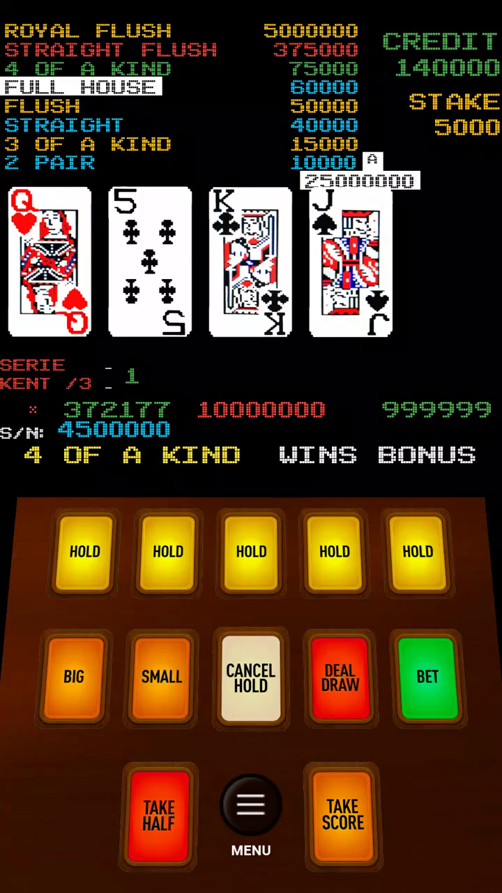

# Game Feel Reference

Primary source: the local gameplay recording set, with curated sample frames tracked in `docs/assets/recording/`

Secondary source: the ai9poker clone screenshot (Google Drive `Recording-2026-03-09-203618.mp4`), which is the closest existing implementation to the target feel.

## Capture Metadata

- duration: `00:11:19`
- orientation: portrait
- frame size: `720x1280`
- frame rate: `30 fps`

## Visual Direction

- black CRT-like playfield with minimal chrome
- rainbow pixel paytable fixed at the top-left
- credit and stake counters fixed at the top-right
- oversized card row centered in the upper-middle
- warm brown control deck occupying the lower third
- beveled, glowing cabinet buttons instead of flat mobile controls

## ai9poker Clone Visual Reference (Authoritative Target)

The clone at ai9poker.com is the closest existing playable reference for our target aesthetic. Below is a pixel-accurate breakdown of its layout, extracted from a 720×1280 screenshot during double-up mode at STAKE 5,000.

### Layout Zones (top to bottom)

1. **Paytable** — Fixed top-left, always visible
   - 8 rows in rainbow pixel font, each with hand name (left-aligned) and payout amount (right-aligned)
   - Row colors (from top): RF=red/white, SF=red, 4K=cyan, FH=yellow, Flush=red, Straight=green, 3K=cyan, 2P=yellow
   - Active jackpot hand has a **solid box/selection highlight** around the text (not just a glow)
   - Payout values update dynamically based on stake: RF×1000, SF×75, 4K×15, FH×12, Fl×10, St×8, 3K×3, 2P×2

2. **Credit & Stake** — Top-right area
   - "CREDIT" label in green, value in white below
   - "STAKE" label in gold/amber, value in white below
   - Both use pixel font at ~18px

3. **Card Area** — Center of screen, large
   - During normal play: 5 cards across
   - During double-up: **single large card centered** (not two side-by-side), with ace showing full card art
   - Card art is crisp, white background with standard suit/rank imagery

4. **Win Amount Display** — Below cards during double-up
   - Large golden number with **outlined/embossed** styling (e.g., "25000000")
   - Active jackpot slot indicator letter next to it (e.g., "A")
   - Gold color with text shadow/outline effect

5. **Jackpot Info Block** — Below win amount, above controls
   - "SERIE - 1" in green text
   - "KENT /3 : 1" in green text  
   - Three jackpot counter values in a row: "× 368977" / "10000000" / "999999" in amber/gold
   - "S/N: 4500000" in green text
   - "4 OF A KIND   WINS BONUS" in large white pixel text, full width

6. **Control Deck** — Bottom third
   - Warm brown wooden surface gradient (not flat dark)
   - Three rows of chunky beveled buttons with 3D depth (shadow below each)

### Button Colors (CRITICAL — differs from most poker games)

| Button | Background | Text | Shadow |
|--------|-----------|------|--------|
| HOLD ×5 | Amber gradient (#e8a020 → #b87818) | Black | Dark brown |
| BIG | Amber gradient (same as HOLD) | Black | Dark brown |
| SMALL | Amber gradient (same as HOLD) | Black | Dark brown |
| CANCEL HOLD | Cream/beige gradient (#e8dcc8 → #c8b8a0) | Dark grey | Tan |
| **DEAL DRAW** | **RED gradient (#ee4444 → #cc2222)** | **White** | **Dark red** |
| **BET** | **GREEN gradient (#44cc44 → #228822)** | **White** | **Dark green** |
| TAKE HALF | Red gradient (same as DEAL DRAW) | White | Dark red |
| MENU | Dark circle (#333 → #1a1a1a) | Grey | Black |
| TAKE SCORE | Orange/amber gradient (warm, brighter than HOLD) | Black | Brown |

> **NOTE**: DEAL DRAW is RED and BET is GREEN. This is the opposite of many Western video poker machines. The Lebanese cabinet lineage uses this color convention.

### Paytable Values (Lebanese Profile at Stake 5,000)

| Hand | Multiplier | Pay at 5K |
|------|-----------|-----------|
| Royal Flush | 1000× | 5,000,000 |
| Straight Flush | 75× | 375,000 |
| 4 of a Kind | 15× | 75,000 |
| Full House | 12× | 60,000 |
| Flush | 10× | 50,000 |
| Straight | 8× | 40,000 |
| 3 of a Kind | 3× | 15,000 |
| 2 Pair | 2× | 10,000 |

### Jackpot System

- Three visible progressive jackpot counters in the info area
- "4 OF A KIND WINS BONUS" message displayed prominently when 4K jackpot is active
- Full House jackpot has a selectable rank (A, K, Q, J, etc.) — indicated by highlight box on paytable row
- Active 4K slot alternates between A and B slots
- SERIE / KENT / S/N are machine identity counters (session/series tracking)
- Jackpot display is always visible even during double-up

### Double-Up Mode

- Single card displayed large and centered (the challenger card)
- Dealer card result overlaid or shown adjacent
- "HI LO GAMBLE" and "ACE ALWAYS WINS" text visible
- Card shuffle animation while waiting for player choice
- BIG = 8 or higher wins, SMALL = 6 or lower wins (7 is a push/lose depending on config)
- Lucky 5 in the shipped clone is now restricted to the SWITCH path: switching onto 5♠ triggers the 4× multiplier + no-lose safety net, while an opening dealer 5♠ or a revealed BIG/SMALL result 5♠ does not
- TAKE HALF and TAKE SCORE always accessible during double-up

### Gameplay Pace

- Deal animation: cards appear sequentially with ~100ms stagger
- Draw: non-held cards flip with brief delay
- Double-up transition: ~1 second after win before auto-entering DU mode
- Card shuffle in DU: rapid random card images cycling at ~80ms
- Win collection: animated credit drain from win display into credit counter
- No excessive pauses or modal dialogs — everything flows within the cabinet screen

## Interaction Cues

- the game keeps the paytable visible during play
- `BIG` and `SMALL` live on the main control deck, not in a detached modal flow
- `TAKE HALF` and `TAKE SCORE` are first-class cabinet actions
- the title / idle state reuses the same machine screen instead of switching to a modern menu shell

## Reconstruction Constraints

- keep the cabinet silhouette intact
- keep portrait-first ergonomics
- use pixel or pixel-adjacent typography for paytable and status text
- keep the control deck physically chunky and color-coded
- avoid generic lobby UI, chip stacks, glossy casino theming, or modern card-table layouts
- match the ai9poker clone's button color conventions (DEAL=red, BET=green)
- match the Lebanese paytable multiplier profile exactly
- jackpot info block must be visible and always present (not hidden behind tabs)

## Sample Frames

### 00:00:30

Notes:

- five-card playfield visible
- `DOUBLE UP` cue present
- amber button deck and red `DEAL / DRAW` button are clearly established

### 00:02:00

Notes:

- card art remains crisp and simple
- score, credit, and stake stay persistent
- there is no extra HUD clutter beyond machine essentials

### 00:06:00

Notes:

- idle/title mode still lives inside the cabinet screen
- machine identity is embedded into the playfield, not separated into a branding screen
- bottom controls remain visible even when no active hand is on screen
