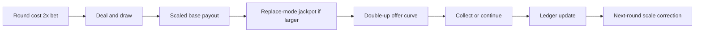

# Lucky5 RTP Rebalancing Architecture

> Target: 85.00% total RTP around the corrected live baseline
>
> Date: 2026-03-14
>
> Status: Revised architecture replacing the prior over-target design

---

## 1. Executive summary

The latest measured baseline establishes that the live engine is now **under target**, not over target:

- Base game RTP vs total 2x-bet round cost: **38.6825%**
- Payout scale plus policy RTP: **65.7957%**
- Full system RTP: **72.8078%**
- Double-up win rate: **76.1%**

This architecture therefore does **not** try to suppress generosity further. It raises the machine from **72.8078%** to a design target of **85.00%** by doing three things together:

1. Raise scaled base-game return materially
2. Make jackpot contribution coherent and consistent
3. Preserve the uncapped double-up fantasy and tune its availability so machine-closing runs remain a real part of the cabinet identity

This document also supersedes the previous cap-based rewrite. Per the latest product direction, the final design now preserves:

- unlimited double-up chains
- ace hi/lo auto-win behavior exactly as the shipped cabinet rule
- 5♠ Lucky5 switch-only no-lose behavior exactly as the shipped cabinet rule
- jackpot plus double-up cabinet-closing fantasy

The governing rule constraint for this revision is simple:

> **RTP must be rebalanced by policy and configuration, not by changing Ace hi/lo or the 5♠ Lucky5 rule set.**

The only structural gameplay threshold change recommended here is lowering machine close from **50,000,000** to **40,000,000** credits so closes happen more often without changing the visible rules.

---

## 2. Direction override relative to the previous draft

The previous architecture draft is obsolete.

It assumed the problem was overshoot and therefore leaned on tight double-up suppression. That no longer matches the measured engine state or the latest product decision.

### Final product-direction decisions

1. **Double-up remains uncapped**
2. **Ace hi/lo auto-win remains enabled**
3. **Lucky5 remains switch-only with 4x first and 2x repeat multipliers**
4. **Jackpot-sized wins remain eligible to feed the double-up fantasy**
5. **Machine close is recommended at 40,000,000 credits instead of 50,000,000**
6. **RTP is lifted upward mainly through scale plus a softer always-on double-up offer curve, not by capping the feature players love most**

### 2.1 Hard rule constraints preserved by this architecture

The following rules are treated as **non-negotiable** and must not be altered by the implementation pass:

1. **Ace remains hi/lo always in double-up**
2. **5♠ Lucky5 remains switch-only**
3. **Lucky5 retains 4x first-hit and 2x repeat-hit multipliers**
4. **Lucky5 SafeFail / no-lose identity remains intact**
5. **Double-up outcomes remain deterministic from the pre-shuffled deck rather than post-choice rigging**

This is the governing architecture for the next implementation pass.

---

## 3. Baseline and required uplift

### 3.1 Current measured baseline

| Layer | Measured RTP |
|---|---:|
| Unscaled base game | 38.6825% |
| Scale plus policy | 65.7957% |
| Full system | 72.8078% |

### 3.2 Missing return to reach target

```text
Target RTP      = 85.0000%
Current RTP     = 72.8078%
Missing RTP     = 12.1922%
```

That missing **12.1922 points** must be restored without removing the Lebanese cabinet feel.

---

## 4. Revised RTP budget

### 4.1 Target budget

| Component | Target RTP | Notes |
|---|---:|---|
| Base game plus payout scale plus policy tiering | **72.50%** | Main lift lever |
| Replace-mode jackpots | **3.50%** | Dream layer |
| Unlimited double-up overlay | **9.00%** | Main excitement layer |
| **Total** | **85.00%** | |

### 4.2 Why this split is coherent

Current scaled base RTP is **65.7957%**. Moving it to **72.50%** adds:

```text
72.50 - 65.7957 = 6.7043 RTP points
```

Current non-base overlay is:

```text
72.8078 - 65.7957 = 7.0121 RTP points
```

Target overlay becomes:

```text
3.50 + 9.00 = 12.50 RTP points
```

Overlay uplift:

```text
12.50 - 7.0121 = 5.4879 RTP points
```

Total planned uplift:

```text
6.7043 + 5.4879 = 12.1922 RTP points
```

That exactly closes the measured gap.

### 4.3 Control philosophy

- **Payout scale** becomes the dominant convergence controller
- **Double-up** stays powerful, but its availability curve stays soft and never fully disappears
- **Jackpots** stay visible and reachable, but their reset values and caps must finally be internally consistent
- **Deck pressure and pity pressure** remain bounded secondary levers only
- **Ace hi/lo and 5♠ Lucky5 rules are not used as balancing levers**

---

## 5. Payout-scale architecture

### 5.1 Measured equilibrium scale

Use the measured unscaled baseline, not the old theoretical assumption:

```text
Target scaled base RTP = 72.50%
Measured base RTP      = 38.6825%
Equilibrium scale      = 0.7250 / 0.386825 = 1.8743
```

This means the controller should orbit close to **1.87 to 1.95**, not **1.72**.

### 5.2 Recommended config values

| Setting | Recommended value |
|---|---:|
| `TargetRtp` | `0.85m` |
| `DefaultPayoutScale` | `1.92m` |
| `MinPayoutScale` | `1.18m` |
| `MaxPayoutScale` | `2.45m` |
| `WarmupRounds` | `80` |
| `CorrectionGain` | `1.10m` |
| `DeadZone` | `0.0075m` |
| `MaxCorrection` | `0.35m` |
| `JitterAmplitude` | `0.03m` |
| `ConvergenceHorizon` | `300` |
| `SmallTierFactor` | `0.99m` |
| `MediumTierFactor` | `1.05m` |
| `BigTierFactor` | `1.12m` |

### 5.3 Controller formula

```text
TargetBaseRtp = 0.8500 - 0.0350 - 0.0900 = 0.7250

ObservedBaseRtp = max BaseCreditsOut / CreditsIn, 0.3200

EquilibriumScale = TargetBaseRtp / ObservedBaseRtp

RampFactor = min 1.0, RoundCount / 300.0

if abs Drift <= DeadZone:
    Correction = 0
else:
    Correction = clamp -Drift * CorrectionGain * RampFactor, -0.35, +0.35

WarmupBias =
    +0.08 at round 1
    linearly decays to 0 by round 80

Jitter = uniform random in [-0.015, +0.015]

RawScale = EquilibriumScale + Correction + WarmupBias + Jitter

SmallScale  = clamp RawScale * 0.99, 1.18, 2.45
MediumScale = clamp RawScale * 1.05, 1.18, 2.45
BigScale    = clamp RawScale * 1.12, 1.18, 2.45
```

### 5.4 Warmup behavior

Warmup should be generous enough to hook play but not so generous that it creates fake early-session overshoot.

Recommended warmup band:

| Tier | Warmup opening value |
|---|---:|
| Small | `1.98` |
| Medium | `2.05` |
| Big | `2.15` |

These values then decay toward the live controller over the first **80 rounds**.

### 5.5 Required cleanup around scaling

The controller only works if there is a single source of truth.

Therefore the next implementation pass must:

1. remove hardcoded counterplay scale bonuses that bypass the controller
2. keep all scale tuning in config only
3. continue subtracting observed jackpot pressure from the base-game controller target
4. avoid using Ace or Lucky5 rule changes as hidden substitute tuning knobs

---

## 6. Explicit double-up architecture

## 6.1 Core rule decision

The revised design **preserves uncapped double-up**.

This is an explicit product-direction override. The architecture is no longer trying to make double-up negative EV in isolation. It is trying to preserve the cabinet fantasy while keeping the **whole machine** near **85%**.

### 6.2 Recommended double-up rule set

| Parameter | Final recommendation |
|---|---|
| Max attempts | **Unlimited** |
| Per-attempt win probability | Preserve current natural behavior around **76.1%** |
| Ace hi/lo auto-win | **Keep enabled exactly as-is** |
| Max collectible per chain | **No chain cap** |
| Lucky5 no-lose | **Keep** on switch-only path |
| Lucky5 first multiplier | `4x` |
| Lucky5 repeat multiplier | `2x` |
| Max switches per round | `2` |
| Double-up deck | Standard shuffled deck by default |
| Machine close threshold | **40,000,000 credits** recommended |

The intent here is explicit: **do not rebalance RTP by nerfing Ace or Lucky5.** The RTP levers for this architecture are payout scale, jackpot structure, offer rate, bounded deck pressure, and machine-close policy.

### 6.3 Why unlimited double-up is retained

Because the player has now explicitly prioritized all of the following over a capped safety design:

- machine-closing runs are a core part of the cabinet identity
- players should occasionally reach close through normal double-up streaks
- players should also be able to combine jackpot-scale wins with double-up to create session-defining moments

### 6.4 Availability curve instead of hard suppression

The old draft suppressed double-up to zero when the machine drifted over target. That is too aggressive for this product direction.

The new rule is:

> Double-up should always remain possible on a nonzero slice of eligible wins.

Recommended offer curve:

| Observed drift vs target | Offer rate on eligible wins |
|---|---:|
| `>= +0.050` | `0.08m` |
| `+0.020 to +0.050` | linearly `0.15m -> 0.08m` |
| `-0.010 to +0.020` | `0.28m` |
| `-0.040 to -0.010` | linearly `0.28m -> 0.45m` |
| `<= -0.040` | `0.60m` |

This keeps the favorite feature alive even in cold correction periods while still giving the machine a meaningful control loop.

### 6.5 Double-up RTP math at target

At equilibrium, use this accounting model:

```text
Eligible pre-DU win RTP      ≈ 0.760
Effective offer rate         ≈ 0.34
Player accept rate           ≈ 0.78
Average incremental gain     ≈ 0.45 of trigger win

DU RTP ≈ 0.760 * 0.34 * 0.78 * 0.45 = 0.0906
```

That is the target **9.0%** double-up contribution.

### 6.6 Machine-closing excitement path

With a recommended close threshold of **40,000,000** credits:

- a multi-million jackpot followed by a short winning chain can realistically close the machine
- a non-jackpot big hit can still close through a longer unlimited run
- take-half sequences can still push the visible machine total above the close threshold in dramatic ways

That keeps the fantasy intact without needing hidden scripted outcomes.

### 6.7 What this design deliberately does not do

It does **not**:

- cap attempts at 3 to 5
- force win rate down to 45 to 48
- remove ace hi/lo auto-win
- change Lucky5 from switch-only
- change Lucky5 away from the current 4x first / 2x repeat identity
- cap collectible value at 50x trigger win

Those ideas are intentionally rejected in this revised architecture.

---

## 7. Hit frequency and player experience

### 7.1 Final decision

The visible Lebanese paytable remains **frozen**.

No One Pair payout path is added.

### 7.2 Rationale

The user has now made two priorities explicit:

1. preserve the original rules feel
2. preserve machine-closing double-up drama

Adding a low-tier visible return path would soften the cabinet into a different game rhythm.

### 7.3 Experience target

Because the paytable stays frozen, the architecture should target:

| Metric | Target |
|---|---|
| Direct paying-spin frequency | **24% to 28%** |
| Medium-or-better base outcomes | **3.5% to 5.0%** |
| Double-up offered on winning rounds | **roughly 28% to 45%** depending on drift |
| Perceived return cadence | **session-level feel near 30% to 40%** once double-up continuations and take-half behavior are included |

This is the key design decision:

> We keep the sparse Lebanese paytable and create excitement through scaled win size, jackpots, and unlimited double-up continuation rather than adding a visible low-tier consolation payout.

That means the machine is rebalanced primarily through **how often** and **how strongly** it pays, not by rewriting the visible double-up rules players already recognize.

### 7.4 Medium-volatility target

The profile should feel like:

- longer dry stretches than pair-paying poker
- more meaningful wins when they do land
- recurring opportunities to turn moderate wins into memorable streaks
- rare but reachable cabinet-closing moments

That is the correct Lucky5 rhythm.

---

## 8. Jackpot architecture

### 8.1 Final jackpot design principles

1. Keep replace mode
2. Make all jackpots nonzero at reset
3. Align reset values and caps across config and service code
4. Keep jackpots reachable but not dominant
5. Preserve jackpot-triggered double-up fantasy on the resulting collectible win

### 8.2 Recommended jackpot values

| Pool | Start | Cap | Per-round contribution | Target RTP share |
|---|---:|---:|---:|---:|
| Four of a Kind A | `160,000` | `1,200,000` | `175` | |
| Four of a Kind B | `160,000` | `1,200,000` | `175` | **1.40% combined** |
| Full House rank jackpot | `100,000` | `750,000` | `120` | **0.85%** |
| Straight Flush | `900,000` | `8,500,000` | `255` | **1.25%** |
| **Total** |  |  | `725 per round` | **3.50%** |

### 8.3 Why these values fit the new direction

- Four of a Kind pools stay visible often
- Full House jackpot remains a meaningful side dream instead of an RTP bomb
- Straight Flush stays the signature cabinet-closing launch point
- Start values are high enough to feel real, but close enough to scaled base payouts that reset-state RTP does not explode

### 8.4 Jackpot plus double-up path

The revised architecture explicitly keeps this path alive:

```text
scaled winning hand
    -> jackpot replaces if larger
    -> resulting collectible amount can enter double-up
    -> winning chain can close the machine
```

That is now a desired behavior, not an accident.

Preserving that path is compatible with the user constraint because it does **not** alter Ace hi/lo logic or the 5♠ Lucky5 rule set; it only changes the overlay economics around them.

---

## 9. System flow



---

## 10. Code change map

## 10.1 `server/src/Lucky5.Domain/Game/CleanRoom/CoreModels.cs`

Change the configuration surface so it matches the new target budget and the preserved uncapped double-up design.

Required changes:

1. Set `TargetRtp = 0.85m`
2. Raise payout scale defaults to the new band:
   - `DefaultPayoutScale = 1.92m`
   - `MinPayoutScale = 1.18m`
   - `MaxPayoutScale = 2.45m`
3. Set warmup and correction defaults:
   - `WarmupRounds = 80`
   - `CorrectionGain = 1.10m`
   - `DeadZone = 0.0075m`
   - `MaxCorrection = 0.35m`
   - `JitterAmplitude = 0.03m`
4. Add a convergence-horizon config value
5. Replace the old two-point double-up offer config with explicit floor, target-band, and max values
6. Set jackpot starts, caps, and contributions to the values in section 8
7. Lower close-related thresholds to the new recommended **40,000,000** level
8. Keep [`Lucky5DoubleUpOptions`](server/src/Lucky5.Domain/Game/CleanRoom/CoreModels.cs:227) uncapped, ace-enabled, and aligned with the existing 5♠ switch-only 4x/2x behavior

## 10.2 `server/src/Lucky5.Domain/Game/CleanRoom/Lucky5DoubleUpEngine.cs`

Keep the gameplay loop intact, but make the close threshold configurable and aligned with the new architecture.

Required changes:

1. Preserve unlimited chaining
2. Preserve ace hi/lo auto-win logic in [`IsWinningGuess()`](server/src/Lucky5.Domain/Game/CleanRoom/Lucky5DoubleUpEngine.cs:198)
3. Preserve switch-only Lucky5 activation and existing 4x/2x multipliers
4. Replace the implicit 50M assumption with the new configured close threshold
5. Do not add attempt caps
6. Do not add chain payout clamps
7. Keep the engine outcome-deterministic from the pre-shuffled deck

## 10.3 `server/src/Lucky5.Domain/Game/CleanRoom/MachinePolicy.cs`

This is the main balancing file.

Required changes:

1. Rework `ResolvePayoutScale` around the **72.50%** scaled-base target
2. Implement the new values for default scale, min, max, jitter, dead zone, and max correction
3. Add the convergence-horizon ramp
4. Keep a nonzero double-up offer floor even when RTP is above target
5. Replace binary suppression with the new soft offer curve from section 6
6. Keep `BuildDoubleUpDeck` standard unless a later simulation pass proves additional pressure is needed
7. Align soft-cap and close thresholds to the recommended 40M close architecture
8. Keep RTP control focused on scale / offer curve / bounded deck pressure rather than any Ace or Lucky5 rule change

## 10.4 `server/src/Lucky5.Simulation/Program.cs`

The simulator must become the primary tuning harness for this architecture.

Required changes:

1. Mirror live service behavior exactly for scale, jackpots, and double-up eligibility
2. Report separate RTP slices for:
   - scaled base
   - jackpot overlay
   - double-up overlay
3. Run fixed windows for:
   - `10,000`
   - `100,000`
   - `1,000,000+`
4. Add machine-close counters at `40,000,000+`
5. Add over-`50,000,000` reporting for take-half plus continuation cases
6. Model at least three player behaviors:
   - conservative collect-first
   - balanced
   - aggressive cabinet-closing
7. Print effective double-up offer rate and realized incremental gain per entered chain

## 10.5 `server/tests/Lucky5.Tests/CleanRoomEngineTests.cs`

The tests must stop assuming a capped double-up future.

Required changes:

1. Keep regression coverage for ace hi/lo auto-win
2. Keep regression coverage for switch-only Lucky5 behavior and current 4x/2x multipliers
3. Add coverage proving unlimited chaining remains valid across repeated wins
4. Add coverage for the configurable close threshold at **40,000,000**
5. Add coverage for the nonzero double-up offer floor when the machine is over target
6. Add coverage for the revised payout-scale defaults and controller band

---

## 11. Validation plan for the next code subtask

### 11.1 Acceptance targets

| Horizon | Target |
|---|---|
| 10K-window median across many samples | **84% to 86%** |
| 100K run | **84% to 86%** |
| 1M+ run | **84.5% to 85.5%** |

### 11.2 Experience validation

The next implementation pass must also report:

1. direct paying-spin frequency
2. medium-win frequency
3. double-up offer rate on winning rounds
4. number of machine closes at 40M+
5. number of sessions ending above 50M through take-half plus continuation

---

## 12. Final architecture decision

The corrected design is:

- **85.00% total RTP target**
- **72.50% scaled base**
- **3.50% jackpots**
- **9.00% unlimited double-up overlay**
- **Ace hi/lo always preserved**
- **5♠ Lucky5 switch-only 4x/2x behavior preserved**
- **machine close lowered to 40,000,000 credits**
- **visible Lebanese paytable preserved**

The revised RTP-control levers are therefore:

1. wider but bounded payout-scale controller tuning
2. a soft nonzero double-up offer curve
3. replace-mode jackpots with coherent starts / caps / contributions
4. bounded deck-pressure policy if later simulation still needs it
5. machine-close threshold tuning

This is the architecture that should guide the next implementation subtask.
